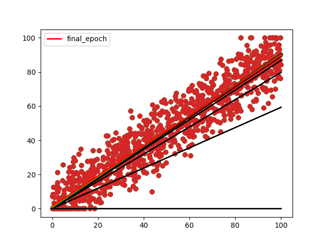
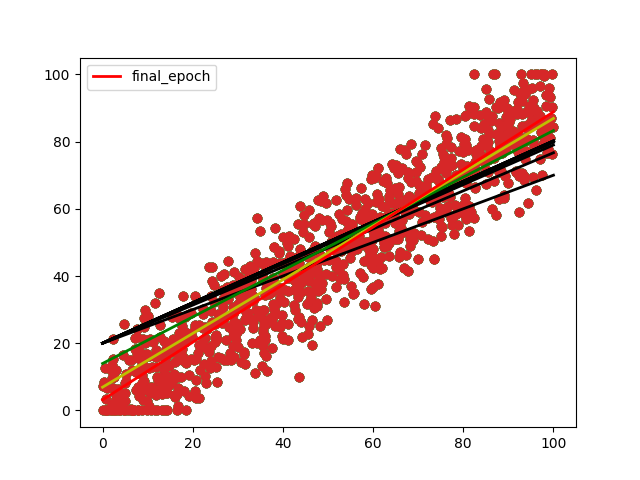

## Linear Regression From Scratch (Single-Neuron Model)

In my current job, I started receiving tasks that involved concepts related to AI, machine learning, and deep learning. Although I studied the fundamentals during university, I felt the need to refresh and solidify my understanding from the ground up.

To do that, I decided to start with the most essential building block in neural networks: 
**A single neuron performing linear regression.**

This project is a simple but complete implementation of linear regression from scratch, without using machine learning libraries. The goal is to understand exactly how a neuron learns through **gradient descent**, how the **Mean Squared Error (MSE)** loss behaves, and how the parameters **weight (w)** and **bias (b)** affect the learning process.

### Project Description

The project contains two main Python files:

**1.** `csvGeneration.py`

This script generates a synthetic dataset and saves it to a CSV file.
It creates a set of input values **x** and corresponding outputs **y** using a linear relationship with some added noise.
This simulates real-world data — for example, predicting temperature from time of day, estimating sales based on advertising budget, or any situation where a linear pattern exists.

**2.** `main.py`

This file contains the full implementation of linear regression using gradient descent.
I implemented:

- A Mean Squared Error (MSE) function

- A gradient descent update rule

- A training loop that iteratively updates w and b until convergence

The prediction function follows the standard linear model:

$$
\hat{y} = w x + b
$$

And the MSE loss is defined as:

$$
\text{MSE} = \frac{1}{N} \sum_{i=1}^{N} (y_i - \hat{y_i})^2
$$

During training, the gradients with respect to `w` and `b` are computed and used to update the parameters in the direction that reduces the loss.

### Visual Results

The repository includes two images that show how the initial choice of weight and bias influences the training speed:

- In one figure, the model starts very close to the optimal line, so the number of epochs needed to converge is small.

    

- In the other figure, the starting parameters are far from ideal, and the training requires many more updates.

    

These visualizations help illustrate how gradient descent behaves depending on the initial conditions.

### Summary

This small project served as a way to revisit the foundations of neural networks by understanding how a single neuron learns a linear relationship.
It reinforces key ideas such as:

- How predictions are computed using `wx+b`

- How the **MSE** loss guides the learning process

- How **gradient descent** adjusts parameters

- Why initialization matters in training dynamics

Even though it’s a simple example, it’s the basis of how more complex neural networks operate.